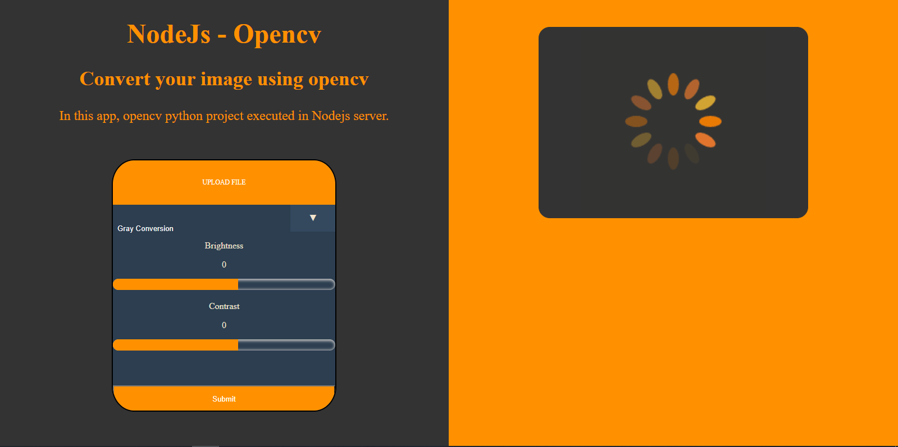

# Nodejs-OpenCVPython-App

  

In this project, using python opencv library, image proccessing operations are made such as Gray Conversion, Dilation, Erosion, 
Noise Removal, Brightness & Contrast settings and histogram equalization.

After that, the server set up using Expressjs in Nodejs. In the server, On the server, the operations requested by the 
user were received from the user via a form. After the form is posted, the python code is run using sub processes. 
The information of the desired operation is transferred to the python script through these sub-processes.

Then the python code performs the operation and writes the new image to the file. The server reads the image 
file from the same folder and sends it to the front-end section created with ejs.

The html file created dynamically with Ejs reads the image it receives from the server and displays it 
on the screen. It also creates a download button for the processed image.   
